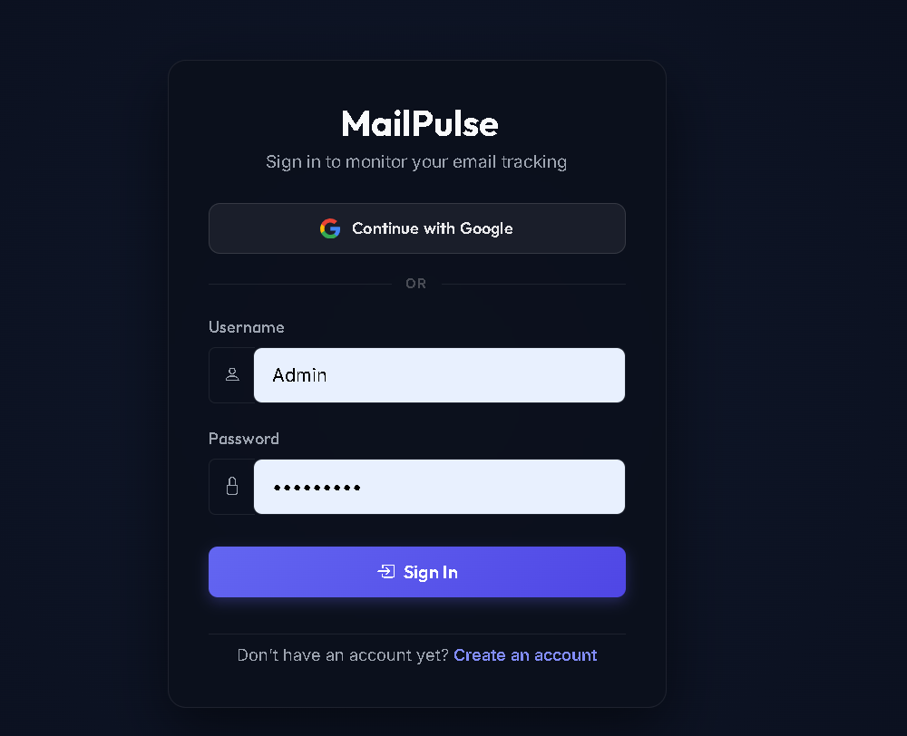
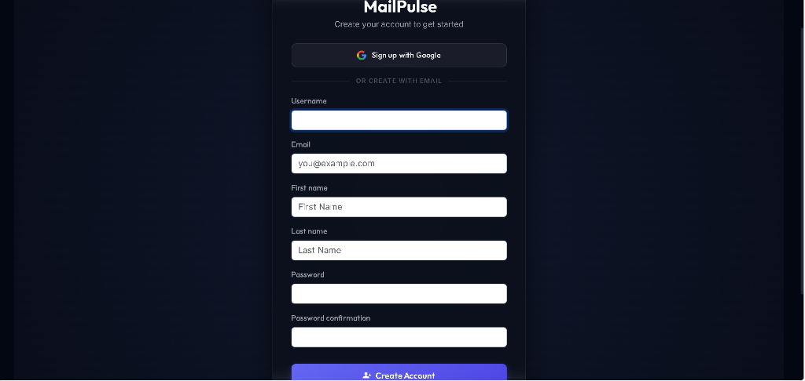
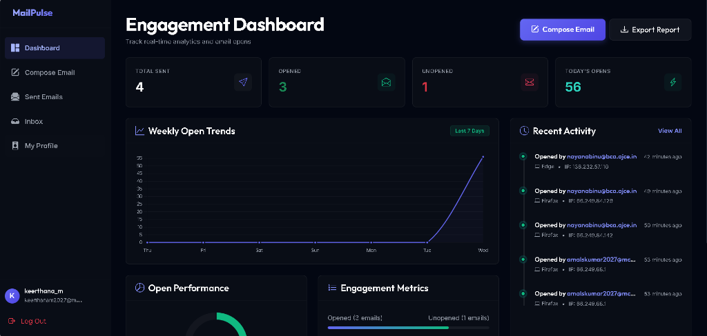
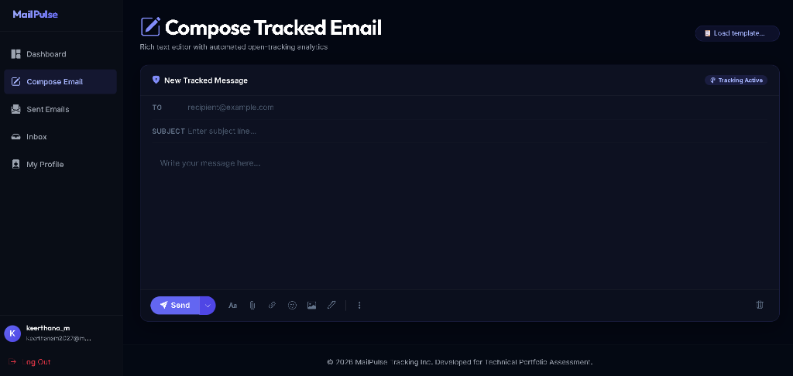
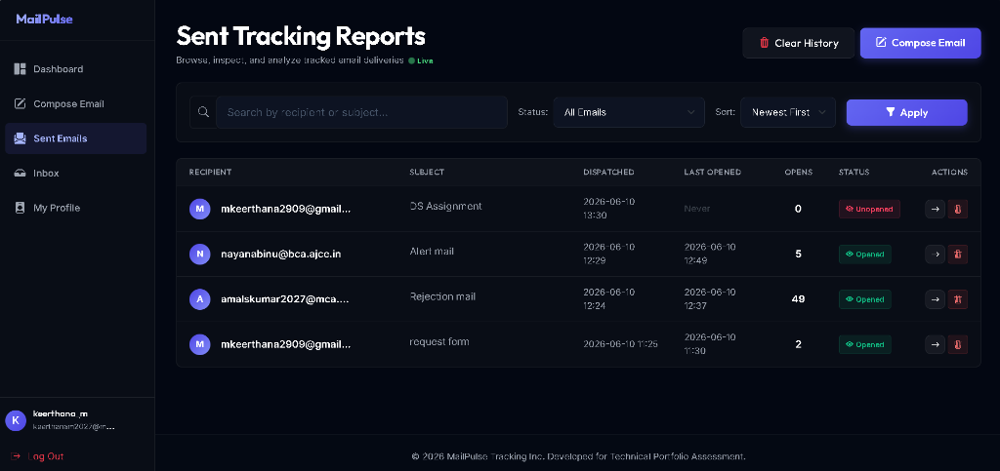
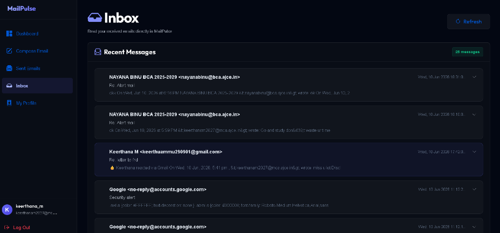
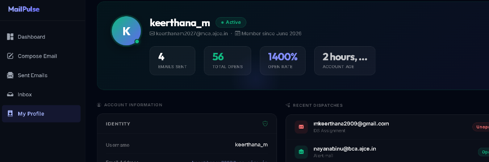

# MailPulse ⚡ — SaaS Email Tracking System

> A production-quality Django 5 SaaS email tracking platform with real-time open analytics, a premium dark UI, and enterprise-grade security.

[](https://python.org)
[](https://djangoproject.com)
[](https://getbootstrap.com)
[](https://sqlite.org)
[](LICENSE)

---

## 📖 Project Overview

**MailPulse** is a full-stack SaaS Email Tracking System similar to Mailsuite or Yesware. It allows authenticated users to:

🌍 **Live Demo:** [https://mailpulse.onrender.com](https://mailpulse.onrender.com)

- Compose rich HTML emails using the **Quill.js** editor
- Send tracked emails via **Gmail SMTP** or a built-in **console fallback** for local development
- Track email opens in real time via a **hidden 1×1 PNG tracking pixel**
- Analyse open telemetry: timestamp, IP address, browser & OS fingerprint
- Filter, search, and paginate the full sent-emails table
- Export tracking reports as a downloadable **CSV file**
- View a live **analytics dashboard** with open rates and an activity timeline

---

## ✨ Key Features

| Feature | Description |
|---|---|
| 🔐 **Secure Auth** | Registration, login, logout with CSRF-protected confirm page |
| 📧 **Rich Composer** | Quill.js editor with HTML validation and header-injection protection |
| 📡 **Tracking Pixel** | 1×1 transparent PNG served with strict no-cache headers |
| 📊 **Dashboard** | Single-query aggregated stats: sent, opened, unopened, open rate |
| 🔎 **Email Manager** | Search, filter by status, sort by date, paginated table |
| 🕵️ **Audit Log** | Per-email chronological timeline of open events with IP + UA |
| 👤 **Profile** | User stats: total dispatched, total opens generated |
| 📥 **CSV Export** | Download full tracking report as a UTF-8 CSV file |
| 📝 **File Logging** | Structured log output to `logs/mailpulse.log` |

---

## 🛠️ Technology Stack

| Layer | Technology |
|---|---|
| Backend | Python 3.12+, Django 5.x |
| Database | SQLite (via `django.db.backends.sqlite3`) |
| Frontend | Django Templates, Bootstrap 5.3, Bootstrap Icons |
| Rich Editor | Quill.js (CDN) |
| Env Config | python-dotenv |
| Email | Django `EmailMultiAlternatives` → SMTP or Console backend |

---

## 📁 Project Structure

```
mailpulse/
│
├── tracker/                        # Core application
│   ├── migrations/
│   │   └── 0001_initial.py
│   ├── static/
│   │   ├── css/
│   │   │   └── styles.css          # Premium dark SaaS theme
│   │   └── js/
│   │       └── app.js              # Quill.js init, sidebar, alerts
│   ├── templates/
│   │   └── tracker/
│   │       ├── base.html           # Layout, sidebar, topbar, toasts
│   │       ├── login.html
│   │       ├── register.html
│   │       ├── logout_confirm.html # CSRF-protected confirm page
│   │       ├── dashboard.html      # Analytics dashboard
│   │       ├── compose.html        # Rich text email composer
│   │       ├── email_list.html     # Paginated sent emails
│   │       ├── email_detail.html   # Per-email audit log
│   │       └── profile.html        # User profile & stats
│   ├── admin.py
│   ├── apps.py
│   ├── forms.py                    # Hardened forms with validators
│   ├── models.py                   # Email + EmailOpen models
│   ├── tests.py                    # 7 unit tests (all passing)
│   ├── urls.py
│   └── views.py                    # CBVs with logging + optimized queries
│
├── mailpulse/                      # Django project config
│   ├── settings.py                 # Logging, email backend, auth URLs
│   ├── urls.py
│   ├── wsgi.py
│   └── asgi.py
│
├── logs/
│   └── mailpulse.log               # Auto-created structured event log
│
├── .env                            # Local environment (not committed)
├── .env.example                    # Template for environment variables
├── requirements.txt
├── manage.py
└── README.md
```

---

## 🗄️ Database Schema

```
┌──────────────────────────────┐       ┌───────────────────────────────────┐
│          auth_user           │       │             tracker_email         │
├──────────────────────────────┤       ├───────────────────────────────────┤
│ id              (PK)         │◄──┐   │ id            (PK)                │
│ username        VARCHAR      │   └──►│ user_id       (FK → auth_user)    │
│ email           VARCHAR      │       │ recipient     EmailField (indexed)│
│ password        VARCHAR      │       │ subject       CharField(255)      │
│ date_joined     DATETIME     │       │ message       TextField (HTML)    │
└──────────────────────────────┘       │ tracking_id   UUID (unique, idx)  │
                                       │ sent_at       DateTimeField       │
                                       │ open_count    PositiveIntegerField│
                                       └──────────┬────────────────────────┘
                                                  │
                                                  ▼
                                       ┌────────────────────────────────────┐
                                       │          tracker_emailopen         │
                                       ├────────────────────────────────────┤
                                       │ id            (PK)                 │
                                       │ email_id      (FK → email)         │
                                       │ ip_address    GenericIPAddressField│
                                       │ user_agent    TextField            │
                                       │ opened_at     DateTimeField        │
                                       └────────────────────────────────────┘
```

- **`open_count`** is a cached integer incremented atomically via Django's `F()` expression to avoid race conditions.
- **`tracking_id`** is a UUID with a database index for fast tracking pixel lookups.

---

## 🔐 Security Architecture

| Threat | Mitigation |
|---|---|
| CSRF on logout | GET `/logout/` renders a confirm page; actual logout requires a CSRF-validated POST |
| Email header injection | `clean_subject()` rejects `\r` and `\n` characters in the subject field |
| Weak passwords | `clean()` in `UserRegisterForm` calls Django's `validate_password()` with user context |
| Unauthorized email access | `EmailDetailView.get_queryset()` scopes to `user=request.user` |
| Tracking pixel cache | Served with `Cache-Control: no-cache, no-store, must-revalidate, private` |
| Race condition on open count | Atomic `F('open_count') + 1` update instead of read-modify-write |
| Hardcoded secrets | All secrets loaded from `.env` via `python-dotenv` |
| Clickjacking | `XFrameOptionsMiddleware` enabled in `MIDDLEWARE` |

---

## 📝 Logging

All tracker events are written to **`logs/mailpulse.log`** (auto-created on startup) and to the console using Django's `LOGGING` configuration.

**Format:** `LEVEL TIMESTAMP MODULE PID TID MESSAGE`

**Events logged:**
- ✅ `New user registered: 'username'`
- ✅ `User 'username' logged in/out`
- ⚠️ `Failed login attempt for username: 'username'`
- ✅ `Email '<uuid>' dispatched to 'recipient'`
- ❌ `Error sending email to 'recipient': <error>`
- ✅ `Pixel '<uuid>' loaded. Client IP: '1.2.3.4'`
- ⚠️ `Invalid tracking ID: '<uuid>'`
- ✅ `User 'username' initiated CSV download`

---

## ⚙️ Environment Configuration

Copy the template:
```bash
cp .env.example .env        # Linux/macOS
copy .env.example .env      # Windows
```

Edit `.env`:
```env
# Django Core
SECRET_KEY=django-insecure-change-me-in-production
DEBUG=True

# SMTP (leave blank to use console backend for local dev)
EMAIL_HOST=smtp.gmail.com
EMAIL_PORT=587
EMAIL_HOST_USER=your-email@gmail.com
EMAIL_HOST_PASSWORD=your-app-password    # Use a Gmail App Password
EMAIL_USE_TLS=True
```

> **Gmail App Password**: Go to your Google Account → Security → 2-Step Verification → App Passwords. Generate a 16-character password for "Mail".

---

## 📥 Installation & Setup

### Prerequisites
- Python 3.12+
- pip

### Steps

**1. Clone the repository**
```bash
git clone https://github.com/keerthuammu/MailPlus.git
cd MailPlus
```

**2. Create and activate a virtual environment** *(recommended)*
```bash
# Windows
python -m venv venv
venv\Scripts\activate

# macOS / Linux
python -m venv venv
source venv/bin/activate
```

**3. Install dependencies**
```bash
pip install -r requirements.txt
```

**4. Configure environment variables**
```bash
copy .env.example .env    # Windows
cp .env.example .env      # macOS/Linux
# Edit .env with your own values
```

**5. Apply database migrations**
```bash
python manage.py makemigrations tracker
python manage.py migrate
```

**6. Create a superuser** *(optional, for Django admin)*
```bash
python manage.py createsuperuser
```

**7. Start the development server**
```bash
python manage.py runserver
```

Open **http://127.0.0.1:8000** in your browser.

---

## 💡 Local Development (Console Email Mode)

When `EMAIL_HOST` or `EMAIL_HOST_USER` are empty in `.env`, MailPulse switches to **Django's console email backend**, printing the full SMTP payload to your terminal.

**Simulating a tracked open locally:**

1. Register an account → Login → Navigate to **Compose Email**
2. Fill in a recipient, subject, and message body → Click **Send**
3. In your terminal, find the printed HTML and locate the pixel tag:
   ```html
   
   ```
4. Open that tracking URL in your browser or with `curl`:
   ```bash
   curl "http://127.0.0.1:8000/track/xxxxxxxx-xxxx-xxxx-xxxx-xxxxxxxxxxxx/"
   ```
5. Return to the **Dashboard** → open count incremented, activity timeline updated ✅

---

## 🧪 Running Tests

```bash
python manage.py test tracker
```

**Test Coverage:**

| Test | Description |
|---|---|
| `test_user_registration` | Form validation, user creation |
| `test_user_login` | Session creation, redirect to dashboard |
| `test_user_logout` | GET → confirm page, POST → session cleared |
| `test_compose_email` | Pixel injection in SMTP outbox, DB record created |
| `test_tracking_pixel_endpoint` | IP/UA capture, open_count increment, PNG response, cache headers |
| `test_dashboard_statistics` | Aggregated metrics: total, opened, rate, today |
| `test_csv_export` | Headers, row content, Content-Disposition |
| `test_unregistered_user_login` | Confirm login fails for unregistered users and displays a custom warning toast |

**Last result:** `Ran 8 tests in 12.8s — OK ✅`

---

## 🔮 Future Enhancements

- [ ] **Link click tracking** — Track individual hyperlinks inside email bodies
- [ ] **Email scheduling** — Celery + Redis task queue for delayed dispatch
- [ ] **Chart.js graphs** — Time-series open trend graphs on dashboard
- [ ] **Multiple recipients / bulk send** — BCC list support
- [ ] **Team accounts** — Multi-user workspaces with shared inboxes
- [ ] **Webhook notifications** — POST to Slack / Zapier on email open
- [ ] **Production deployment** — Gunicorn + Nginx + PostgreSQL + Docker
- [ ] **Rate limiting** — Protect compose endpoint from spam abuse

---

## 📸 UI Screenshots & Showcase

### 1. User Sign In
A clean, secure, and authenticated login page using standard Django session authentication and Google OAuth integration options.


### 2. Create Account
User registration form styled with custom modern input controls. The default lengthy Django password validator lists have been removed for a cleaner UX.


### 3. Engagement Dashboard
Real-time aggregated statistics tracking open metrics, weekly trend charts, and chronological audit activity feeds.


### 4. Compose Tracked Email
Quill.js-powered rich composer with templates, link insertion, emoji pickers, email signature injections, and file/folder attachment support.


### 5. Sent Tracking Reports
Fully searchable, filterable, and paginated records of all dispatched emails, showing the real-time status and quick actions.


### 6. Inbox Viewer
Integrated secure IMAP client displaying incoming emails with detailed previews.


### 7. My Profile
A summary of user statistics, email dispatch rates, open counts, and general profile settings.


---

## 📄 License

This project is built for technical portfolio and assessment purposes.
MIT License — free to use, modify, and distribute.
